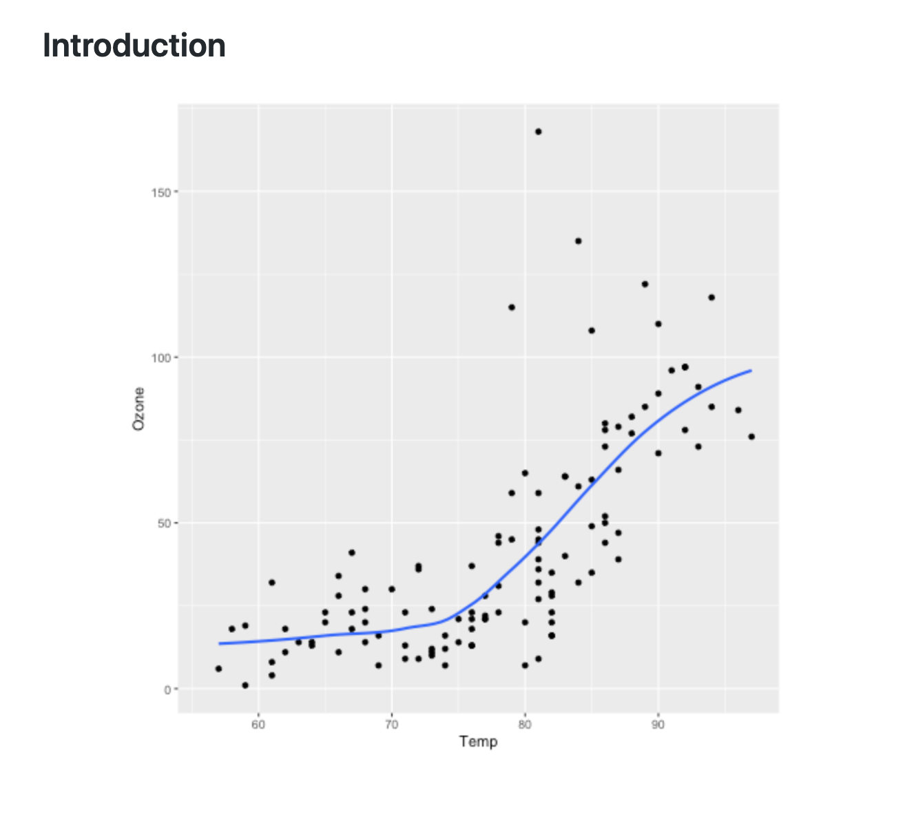

# Idyll RunScripts plugin

The purpose of this plugin is to enable you to embed scripts in your Idyll markup that run at compile time.

For example, this Idyll markup runs R code to generate an inline chart in the idyll output:

````
# Introduction

```exec:rstats
library(ggplot2)
ggplot(airquality, aes(Temp, Ozone)) +
        geom_point() +
        geom_smooth(method = "loess", se = FALSE)
```

````



At this point in time consider this plugin experimental. It is very rudimentary and is primarily meant to serve
as a proof of concept to see if people are interested in this functionality. If they are we can expand on it.

## Installation

```
$ npm install --save-dev idyll-plugin-runscripts
```

Add it to your idyll configuration in `package.json`:

```json
"idyll": {
  "compiler": {
    "postProcessors": ["idyll-plugin-runscripts"]
  }
}
```

## Supported languages

At the moment we only support R, but others could be added in the future.

### R

The R support assumes that you will be creating some sort of graphical output using the
default built-in graphics device.

In order for this to work, you need to make sure the `Rscript` binary is available on your system
and that you are creating one plot per code cell, not using any custom filenames.
